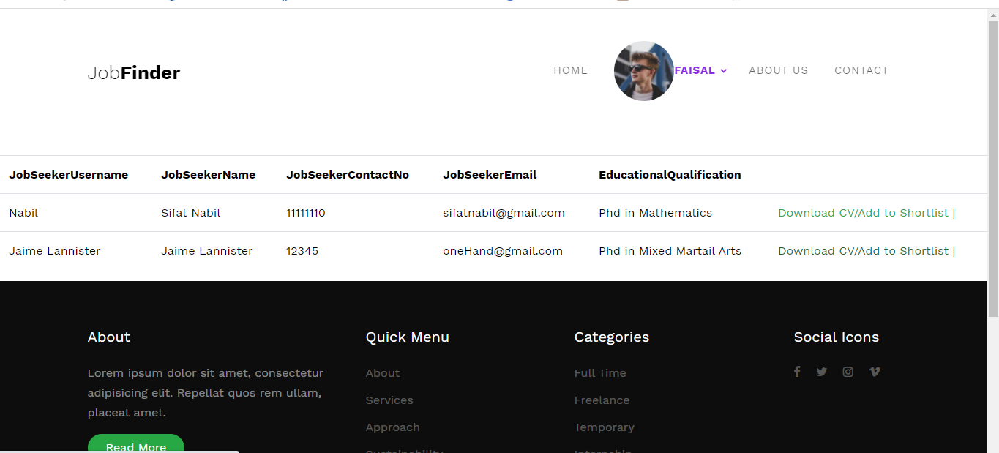
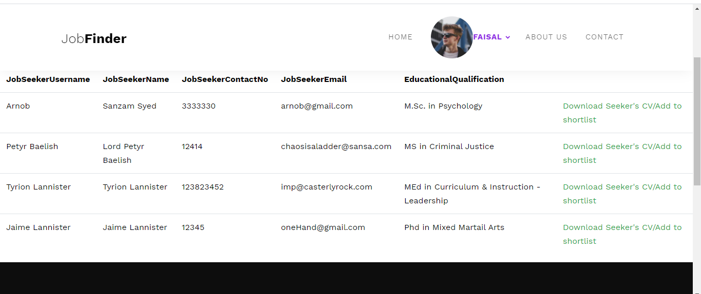
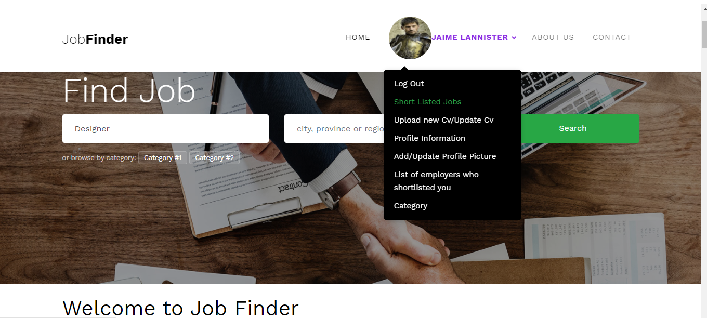
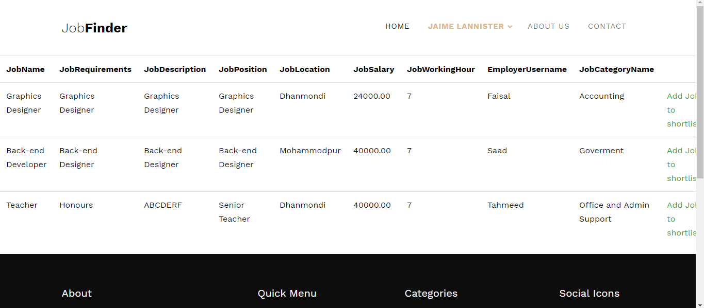
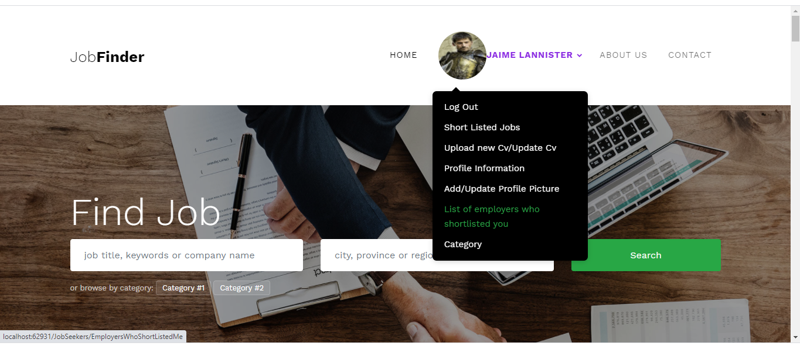
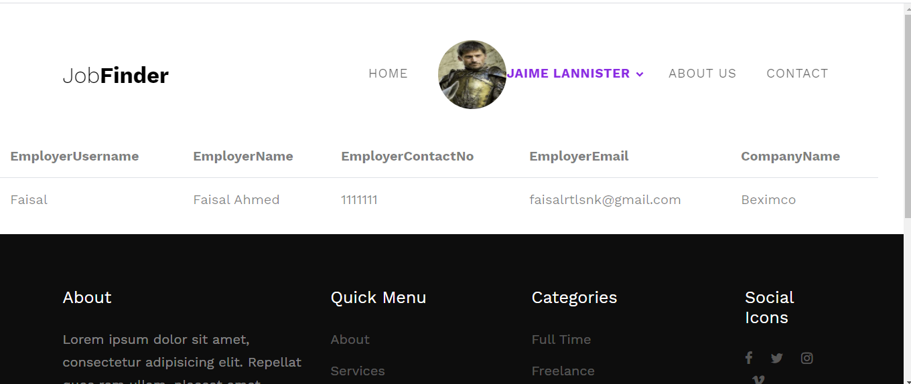
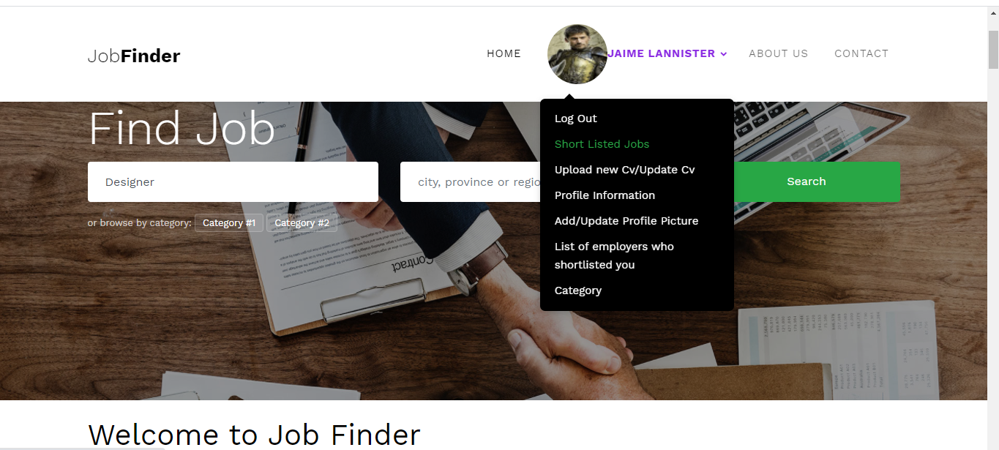
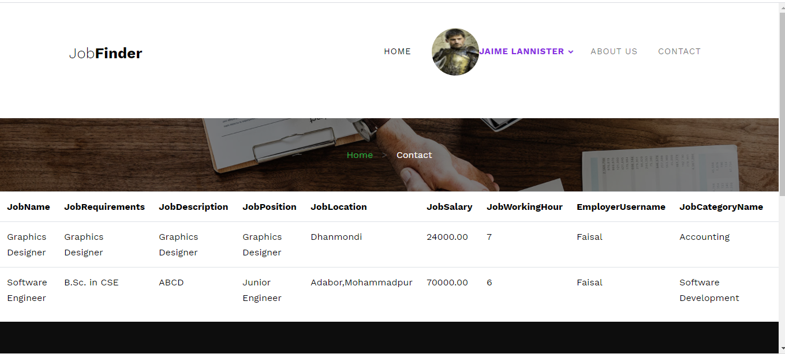

# Online-Job-Portal

## Table of contents

* [Introduction](#introduction)

* [Features](#features)

* [Technologies](#technologies)

* [Demo Screenshots](#demo-screenshots)

* [Setup](#setup)

## Introduction

This project is aimed at developing an online search portal for the placement details for job seekers. The system is an online application that can be accessed with proper login provided. Job seekers should be able to upload their information in the form of a CV. Visitors/Company representatives may also access/search any information put up by job aspirants and also can publish any job advertisements. This group project was built for an undergraduate academic course.

## Features

This website has two users:

1. Jobseekers:

  * Can update their pofile information
  
  * Can upload CV/Resume
  
  * Can upload profile picture and update it

  * Can search for job advertisements using job title, company name, keywords, location (city, province, region)
  
  * Can short list any job advertisement which they like
  
  * Can see detailed information of employers who shortlisted them
  
2. Employers:

  * Can update their pofile information
  
  * Can upload profile picture and update it
  
  * Can post job advertisements
  
  * Can see all the job advertisements posted by them
  
  * Can search for seekers by their educational degree/qualification
  
  * They can shortlist their preferred candidates from the search result by downloading their CV/Resume
  
  * They can keep track of all the seekers they shortlisted
  
  * They can see the detailed contact information of the seekers who shortlisted the jobs published by them
  
  

  

  ## Technologies
  * ASP.NET MVC
  * HTML
  * Javascript
  * CSS
  * SCSS
  * C#
  * Microsoft SQL Server
  * Microsoft Visual Studio
  
  ## Demo Screenshots
  

 
 
  <h3> Features available to the employers  </h3>

 

 

  <h3> Employers can search candidates by their educational degree</h3>
  
 
 
 

 

  <h3> They can shortlist their preferred candidate from the search result by downloading their CV/Resume </h3>
  
 
 
 

 
 

 <h3> They can see which seekers shortlisted the jobs which they published on this site </h3>
 
  
  
 

  <h3> Features available to the seekers </h3>
  
 
 
 

 
 

  <h3> Seekers can search for job advertisements using job title, company name, keywords, location (city, province, region) </h3>
  
 
 
 

 
 
 

  <h3> They can short list any job advertisement which they like from the search result </h3>
  
 
 
 

 
 
  

 <h3> They can see detailed information of employers who shortlisted them </h3>
 
  
  
 

 <h3> They can see the job advertisements they shortlisted  </h3>
 
  
  
 

 

 
 ## Setup
 
It is better to use Microsoft Visual Studio IDE (Integrated Development Environment) to run this project properly. The 'JOBPORTAL.sln' file should be opened with the IDE to  built the project and to run it.
